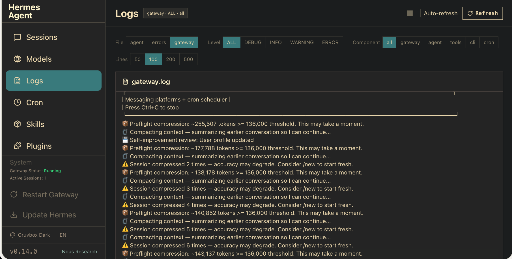

# Hermes Dashboard Themes

Two hand-crafted themes for the Hermes Agent web dashboard.

## Problem

The default Hermes dashboard looks the same in every environment. A bright dark-mode dashboard is hard to read in daylight, and a light dashboard strains your eyes in a dark room. Neither matches your workspace aesthetic, and the default Kanban column layout forces horizontal scrolling.

## Built

Two complete themes: Clean WebUI (white canvas, dark text, blue accents, 18px base font, wrapping Kanban columns) and Gruvbox Dark (warm earthy dark mode inspired by the classic gruvbox palette, cream text, aqua links, wrapping columns). Both include proper border hierarchy, sidebar contrast, and JetBrains Mono for code.

## Outcome

Drop in the theme YAML files and the dashboard matches your environment instead of fighting it. Clean WebUI works in bright offices and coffee shops. Gruvbox Dark is comfortable for late-night sessions. Both fix the Kanban column wrapping so you don't need to scroll horizontally.

## Themes

### Clean WebUI

A plain white web-app theme with black text, blue accents, normal-case sans-serif typography, and wrapping Kanban columns. Strips away the dark backdrop, glow, grain, and filler images for a clean, readable interface.

**Features:**
- White canvas with dark (#111827) text
- Blue (#2563eb) accents for links, buttons, active states
- JetBrains Mono for code/monospace
- 18px base font size for comfortable reading
- Wrapping Kanban columns (no horizontal scroll)
- Visible borders via proper `--border` HSL variable wiring
- Subtle sidebar background (`#f9fafb`) for chrome/content separation
- 500-weight sidebar nav for easy scanning

### Gruvbox Dark



A warm earthy dark mode inspired by the classic [gruvbox](https://github.com/morhetz/gruvbox) color palette. Easy on the eyes and cozy for late-night dashboard sessions.

**Features:**
- Warm dark canvas (#1d2021) with cream text (#ebdbb2)
- Gruvbox blue (#458588) for primary actions and ring highlights
- Gruvbox aqua (#83a598) for links
- JetBrains Mono for code, Inter for UI text
- Same readability improvements as Clean WebUI (borders, sidebar, hierarchy)
- Wrapping Kanban columns

## Installation

1. Copy the theme YAML file(s) to your Hermes dashboard themes directory:

```bash
mkdir -p ~/.hermes/dashboard-themes
cp references/clean-webui.yaml ~/.hermes/dashboard-themes/
cp references/gruvbox-dark.yaml ~/.hermes/dashboard-themes/
```

2. Reload your Hermes dashboard in the browser.

3. Open the theme picker (bottom-left corner of the dashboard) and select your theme.

Themes apply immediately — no restart required.

## Customization

Both themes are plain YAML. Ask your agent to modify any value and save it back to `~/.hermes/dashboard-themes/`. After saving, switch away from the theme in the picker and back to re-apply.

Key things you can tweak:
- **Palette**: background/midground/foreground colors and opacity
- **Typography**: fonts, base size, line height
- **Layout**: border radius, density (compact/comfortable/spacious)
- **Color overrides**: any shadcn-compat token (primary, muted, border, accent, etc.)

The `customCSS` block in each theme handles framework-specific overrides that can't be expressed as CSS variables.

## Notes

- **Clean WebUI** is based on [fplanque/hermes-agent-dashboard-theme-clean](https://github.com/fplanque/hermes-agent-dashboard-theme-clean), modified with readability improvements and the Tailwind `--border` variable fix.
- Themes use `--border: <HSL>` in `:root` to ensure Tailwind's `border-border` utility class renders the theme's border color. Without this, borders render as a faint opacity of the midground color regardless of `--color-border`.
- The `border-border { border-color: var(--color-border) }` override provides a safety net for components that bypass the HSL variable.
- Sidebar gets its own background color to visually separate chrome from content — something the default themes don't do.
